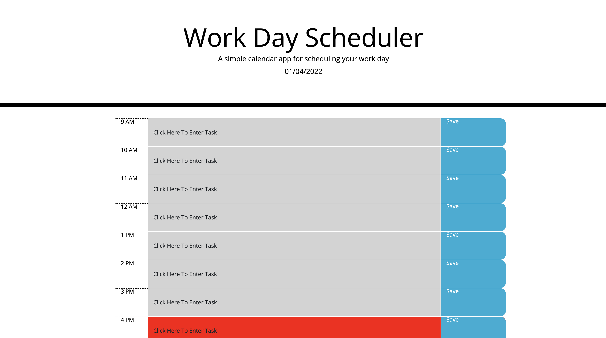

# Calendar
Task management Calendar

This calendar allows you to edit tasks in each business hour and to record them in local storage by clicking the save button. 

Additionally, the rows in the past will display as grey, current hour as red and future hours as green. This will refresh every minute, and colors will change accordingly. 

To edit a task, you just need to click into the task, change the internal text, and either click out of it or press the enter key. 

In order to not lose tasks and save to local storage, you must press the save key on the right side of the tasks.

Deployed Application is live [here](https://splitrabbit.github.io/Calendar/) .

Screenshot: 